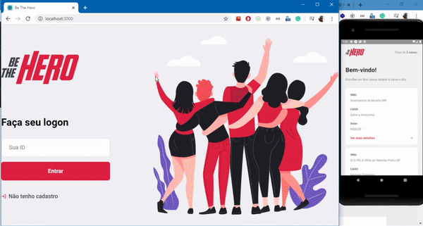

<h4 align="center" style="font-size: 26px" > 
    # Be The Hero | Semana OmniStack 11.0 by RocketSeat
</h4>

<h1 align="center">
    
</h1>

<p align="center">
	
  <a href="https://www.linkedin.com/in/marcelo-leite-junior-472a9313a/">
    
  </a>

  <a href="https://github.com/DanielObara/SemanaOmnistack11/commits/master">
    
  </a>

<a aria-label="Completed" href="https://rocketseat.com.br/">
    </img>
  </a>
  
</p>

<p align="center">
  <a href="#-sobre">Sobre</a>&nbsp;&nbsp;&nbsp;|&nbsp;&nbsp;&nbsp;
  <a href="#rocket-Tecnologias">Tecnologias</a>&nbsp;&nbsp;&nbsp;|&nbsp;&nbsp;&nbsp;
  <a href="#-como-usar">Como Usar</a>&nbsp;&nbsp;&nbsp;|&nbsp;&nbsp;&nbsp;
  <a href="#-como-contribuir">Como Contribuir</a>&nbsp;&nbsp;&nbsp;|&nbsp;&nbsp;&nbsp;
  <a href="#memo-licença">Licença</a>
</p>

## 💻 Sobre

Be The Hero conecta ONGs e pessoas interessadas em ajudar.


## :rocket: Tecnologias

This project was developed with the following technologies:

- [Node.js](https://nodejs.org/en/) 
- [React](https://reactjs.org)
- [React Native](https://facebook.github.io/react-native/)
- [Expo](https://expo.io/)

## :information_source: Como Usar

Para clonar e rodar esta aplicação, você vai precisar do [Git](https://git-scm.com), [Node.js][nodejs] + [Yarn][yarn] instalados em seu computador.

Da linha de comando:

### Instalando a API
```bash
# Clone this repository
$ git clone https://github.com/DanielObara/SemanaOmnistack11

# Go into the repository
$ cd be-the-hero/backend

# Install dependencies
$ yarn install

# Run Migrates
$ yarn knex migrate:latest 

# Run Seeds
$ yarn seed

# Run the API
$ yarn dev
```

## 🤔 Como Contribuir

- Crie um fork;
- Crie uma branch com sua melhoria (feature): `git checkout -b my-feature`;
- Faça commit das mudanças: `git commit -m 'feat: Minha nova feature'`;
- De um push de sua mudança: `git push origin my-feature`.

## :memo: Licença

Este projeto está sobre a licença MIT. Ler [LICENSE](LICENSE.md) para detalhes.

## Agradecimentos

- Agradeço à Rocketseat pelos conteúdos do canal e os cursos/bootcamps.
- Agradeço à Daniel Obara pela inspiração deste Readme.md (aprendi muito): [Daniel Obara!](https://www.linkedin.com/in/danielobara/)

---

Feito com ♥ por Marcelo Leite Junior :wave: [Entre em contato!](https://www.linkedin.com/in/marcelo-leite-junior-472a9313a/)
